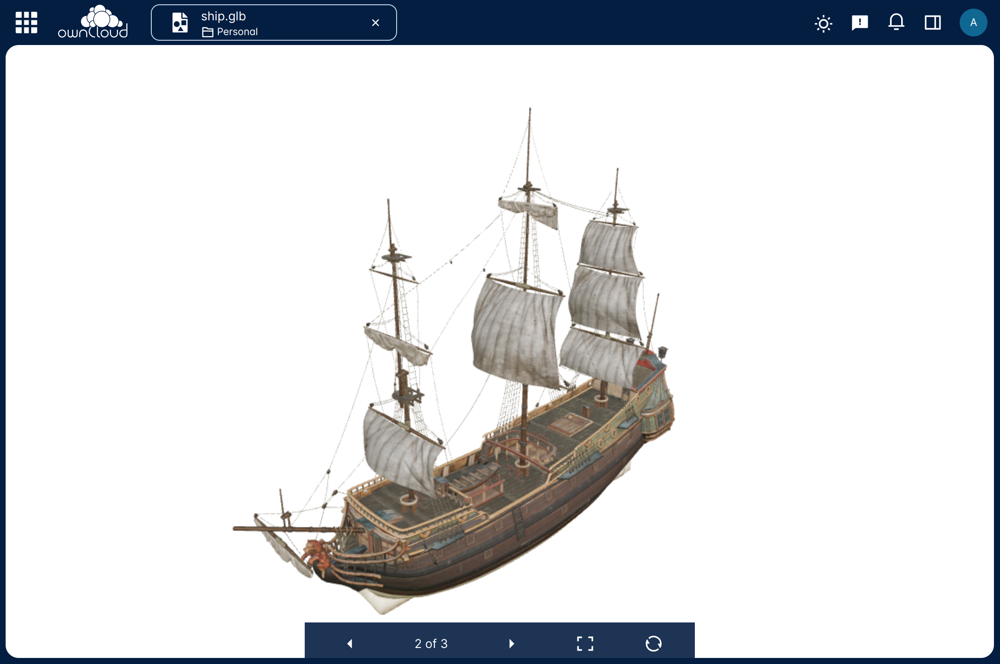

# 3D Model Viewer - ownCloud Web Extension



This is an extension for [ownCloud web](https://github.com/owncloud/web) for viewing 3D files.

## Feature Highlights ✨

- Supported formats: [`.glb`, `.stl`, `.fbx`, `.obj`]
- Zoom/Rotate model
- Fullscreen view
- Navigate between model files

## [Demonstration](https://ocis.in-nepal.de/s/dSlOHjJcQSYuPxV)

## Installation

1. Download the zip file from the [releases page](https://github.com/saw-jan/web-app-3dmodel-viewer/releases)  
2. Extract the zip file to the apps directory of the oCIS server, [which is set using the `WEB_ASSET_APPS_PATH` environment variable](https://doc.owncloud.com/ocis/next/deployment/webui/webui-customisation.html#extend-web-ui-with-apps)

## Build and Run for development

For building and running the app from the code base, follow these steps: 

1. Install the dependencies

   ```bash
   pnpm i
   ```

2. Build the extension

   ```bash
   pnpm build
   ```

   For development, build with watch.

   ```bash
   pnpm build:w
   ```

3. Start the extension and the web services

   ```bash
   docker compose up
   ```

Now, you can access the app at https://localhost:9200

## 3D models

You can find models on the following platforms:

- [sketchfab](https://sketchfab.com/)
- [3Dexport](https://3dexport.com/free-3d-models)
- [archive3D](https://archive3d.net/)
- [clara.io](https://clara.io/library)
- [downloadfree3D](https://downloadfree3d.com/file-format/glb/)
- [free3D](https://free3d.com/)
- [sketchup](https://3dwarehouse.sketchup.com/)
- [turbosquid](https://www.turbosquid.com/Search/3D-Models/free)
